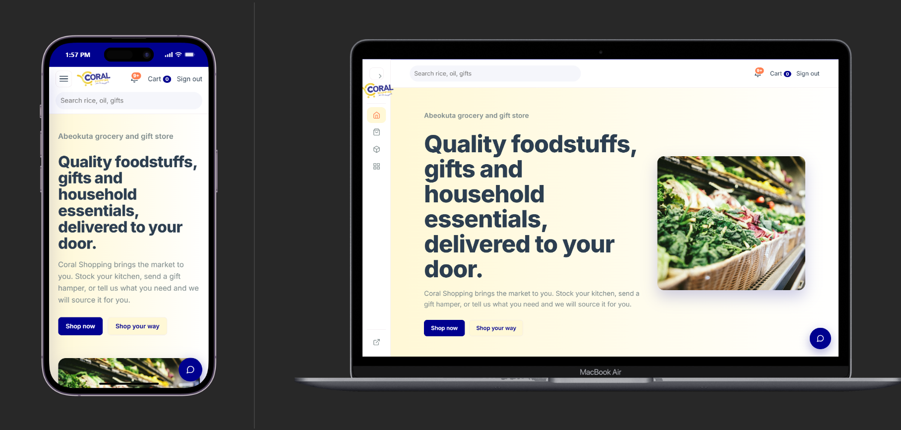
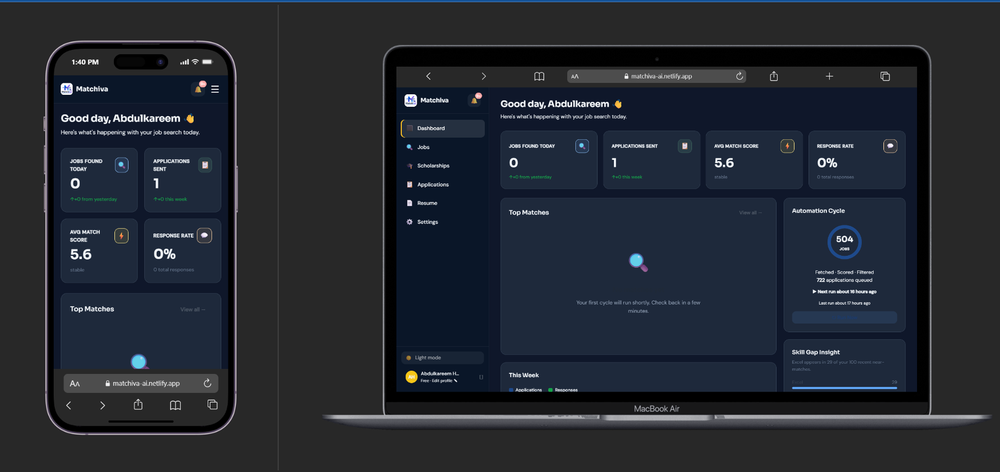
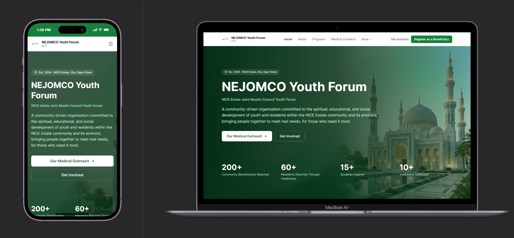
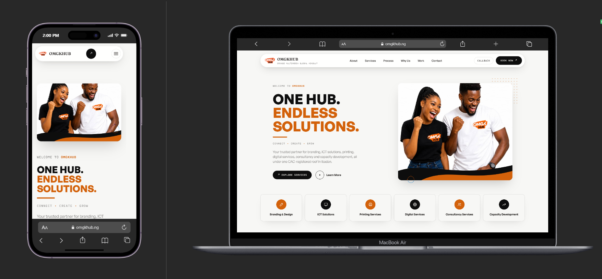
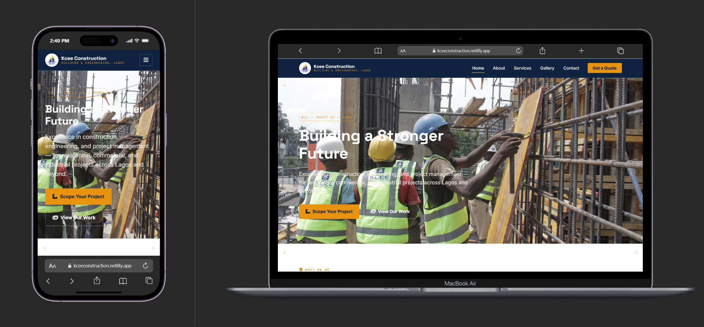

<h1>Building things people actually use.</h1>

I build practical digital products that turn real world problems into useful software.

<a href="https://deuniq.vercel.app/">Portfolio</a>
&nbsp;&nbsp;•&nbsp;&nbsp;
<a href="https://github.com/Deuniq01">GitHub</a>
&nbsp;&nbsp;•&nbsp;&nbsp;
<a href="https://x.com/deuniq01">X</a>

 

<table>
<tr>
<td width="50%" valign="top">

## About Me

I am **Deuniq**, a web developer from Nigeria with a background in Statistics and a growing focus on building complete digital products.

My work sits at the intersection of:

**Development:**
Building web applications, platforms, dashboards and e commerce systems.

**Product Thinking:**
Understanding the problem first, then designing and building the system around it.

**Analytical Thinking:**
Using my Statistics background to approach problems with structure, logic and attention to data.

**Design & Strategy:**
Bringing together interfaces, branding, content and technology where the project requires it.

</td>

<td width="50%" valign="top">

## What I Do

**I build:**
<ul>
<li>Practical web applications</li>
<li>Digital platforms</li>
<li>E commerce products</li>
<li>Dashboards and CMS platforms
<li>Database driven applications
<li>API powered applications
<li>AI assisted products
<li>Business websites
<li>Automation workflows
</ul>
My goal is simple:

> Build software that solves a real problem and is useful beyond the development process itself.

</td>
</tr>
</table>

 

## Technology Stack

<table>
<tr>
<td width="50%" valign="top">

### Languages

</td>

<td width="50%" valign="top">

### Frontend

</td>
</tr>

<tr>
<td width="50%" valign="top">

### Backend & Database

  

Supabase
PostgreSQL
Supabase Auth
REST APIs
Third party APIs
AI APIs

</td>

<td width="50%" valign="top">

### Authentication

Supabase Auth
JWT
OAuth
Custom authentication

</td>
</tr>

<tr>
<td width="50%" valign="top">

### Development Tools

  

Cursor
PowerShell
Windows development environment

</td>

<td width="50%" valign="top">

### Deployment

  

Netlify
Vercel
Production web deployment

</td>
</tr>
</table>

 

## What I Build

<table>
<tr>

<td width="25%" align="center" valign="top">

### Web Applications

Business applications and platforms designed around real workflows.

</td>

<td width="25%" align="center" valign="top">

### E Commerce

Shopping experiences, product systems, ordering workflows and customer dashboards.

</td>

<td width="25%" align="center" valign="top">

### AI Products

Applications that use AI where it adds practical value to the product.

</td>

<td width="25%" align="center" valign="top">

### Digital Systems

CMS platforms, dashboards, registration systems and organizational tools.

</td>

</tr>
</table>

 

# Featured Projects

These projects represent different sides of how I approach digital product development, from e commerce and AI products to organizational systems and business platforms.

 

<!-- CORAL SHOPPING -->

<table width="100%" cellpadding="0" cellspacing="0">
<tr>
<td bgcolor="#0D47A1">

<h2 style="color:white;">01 &nbsp; Coral Shopping</h2>

</td>
</tr>
</table>

 

 

<table width="100%">
<tr>
<td width="65%" valign="top">

### E Commerce Platform

A production oriented shopping platform built for **Coral Shopping**, combining product discovery, customer accounts, ordering, payment workflows, inventory aware purchasing and an AI shopping assistant.

The application goes beyond a storefront by connecting customer workflows, order management, inventory logic, payment processing and administration in one system.

 

**Key Capabilities**
<ul>
<li>Product catalogue and search
<li>Category and aisle-based browsing
<li>Stock aware cart
<li>Customer authentication
<li>Checkout and delivery details
<li>Bank transfer payment workflow
<li>Customer order dashboard
<li>Order status tracking
<li>Protected administration area
<li>Product and order management
<li>Custom shopping requests
<li>AI shopping assistant
<li>Server side price and stock validation
<li>PostgreSQL backed data model
<li>Supabase Row Level Security
</ul>
</td>

<td width="35%" valign="top" align="center">

### Stack

  

**Frontend:**  
React 
Vite  
React Router

 

**Backend:**  
Supabase  
PostgreSQL  
Supabase Auth 

 

**AI:**  
AI shopping assistant

 

**Deployment:**  
Vercel   Netlify

</td>
</tr>
</table>

 

 

 
 

<!-- MATCHIVA -->

<table width="100%" cellpadding="0" cellspacing="0">
<tr>
<td bgcolor="#1565C0">

<h2 style="color:white;">02 &nbsp; Matchiva</h2>

</td>
</tr>
</table>

 

 

<table width="100%">
<tr>
<td width="65%" valign="top">

### AI Assisted Opportunity Discovery

Matchiva is an AI assisted opportunity discovery platform that helps users find relevant jobs and scholarships through automated sourcing, resume based matching and explainable eligibility logic.

The product combines opportunity aggregation, resume analysis and AI powered matching to reduce the amount of manual searching users need to do.

 

**Key Capabilities**
<ul>
<li>Automated job discovery
<li>Resume based opportunity matching
<li>AI assisted CV parsing
<li>Job relevance scoring
<li>Scholarship discovery
<li>Explainable scholarship eligibility
<li>Multiple job source integrations
<li>Opportunity aggregation
<li>Serverless processing
<li>Supabase backed data
</ul>
 

**Opportunity Sources**

Matchiva integrates multiple job sources, including Amazon Jobs, Working Nomads, HotNigerianJobs and Jobspresso, alongside aggregation services.

 

**AI**

Google Gemini handles CV parsing and scholarship structure extraction.

</td>

<td width="35%" valign="top" align="center">

### Stack

  

**Frontend**  
React 
Vite

 

**Backend**  
Supabase  
Netlify Functions

 

**AI**  
Google Gemini

 

**Data**  
PostgreSQL

 

**Product Focus**  
Jobs  
Scholarships  
AI matching

</td>
</tr>
</table>

 

 

 
 

<!-- NYF CMS -->

<table width="100%" cellpadding="0" cellspacing="0">
<tr>
<td bgcolor="#1976D2">

<h2 style="color:white;">03 &nbsp; NYF CMS</h2>

</td>
</tr>
</table>

 

 

<table width="100%">
<tr>
<td width="65%" valign="top">

### Medical Outreach Management Platform

NYF CMS is a real world management platform built for **NEJOMCO Youth Forum** to support the organisation and its medical outreach operations.

The system brings public registration, beneficiary management, clinical workflows, inventory, volunteers, reporting and administration into one application.

 

**Core Modules**
<ul>
<li>Beneficiary registration
<li>Check-in
<li>Vital signs
<li>Consultation
<li>Laboratory
<li>Eye screening
<li>Pharmacy
<li>Medication inventory
<li>Queue management
<li>Volunteer management
<li>User and role management
<li>Sponsorship management
<li>Reports and exports
<li>Audit logging
<li>Public organisation website
<li>Blog management
</ul>
 

The system is designed around a real operational workflow, not just a collection of static pages.

</td>

<td width="35%" valign="top" align="center">

### Stack

  

React 19  
TypeScript  
Vite  
Tailwind CSS v4

 

Supabase PostgreSQL  
Supabase Auth  
Google OAuth  
Supabase Realtime  
Row Level Security

 

Zustand  
React Hook Form  
Zod

 

PWA  
Workbox  
Vercel

</td>
</tr>
</table>

 

 

 
 

<!-- OMGKHUB -->

<table width="100%" cellpadding="0" cellspacing="0">
<tr>
<td bgcolor="#0D47A1">

<h2 style="color:white;">04 &nbsp; OMGKHUB</h2>

</td>
</tr>
</table>

 

 

<table width="100%">
<tr>
<td width="65%" valign="top">

### Business Website & Digital Platform

OMGKHUB is a multi page business website built with reusable page generation and shared interface structures instead of maintaining every page independently.

The project demonstrates how a static business website can still have a structured development architecture with reusable components, generated pages and integrated business workflows.

 

**Architecture**
<ul>
<li>Shared navigation
<li>Shared footer
<li>Reusable page sections
<li>Automated page generation
<li>Contact workflows
<li>Service booking forms
<li>Quote requests
<li>Callback requests
<li>Custom 404 page
<li>Sitemap
<li>Robots configuration
<li>Netlify Forms integration
</ul>
 

The project demonstrates an approach to building maintainable static websites with shared architecture rather than repeatedly duplicating markup.

</td>

<td width="35%" valign="top" align="center">

### Stack

  

HTML  
CSS  
JavaScript

 

Node.js page generation

 

Reusable page architecture

 

Netlify Forms

 

Production deployment

</td>
</tr>
</table>

 

 

 
 

<!-- KCEE -->

<table width="100%" cellpadding="0" cellspacing="0">
<tr>
<td bgcolor="#1E88E5">

<h2 style="color:white;">05 &nbsp; Kcee</h2>

</td>
</tr>
</table>

 

 

<table width="100%">
<tr>
<td width="65%" valign="top">

### Business Website

A web project built for **KCee Construction Ltd**, one of the earlier projects in my development portfolio.

The project reflects my work across business websites, interface development and translating business requirements into functional web experiences.

 

**Focus Areas**

<li>Business website development
<li>Interface implementation
<li>Responsive layouts
<li>Translating business requirements into web experiences

</td>

<td width="35%" valign="top" align="center">

### Stack

  

HTML  
CSS  
JavaScript

 

Business website development

</td>
</tr>
</table>

 

 

# Engineering Areas

<table>
<tr>

<td width="33%" valign="top">

### Product Development

Taking an idea from problem definition to a working product.

</td>

<td width="33%" valign="top">

### Web Engineering

Building interfaces, application logic, data flows and production deployments.

</td>

<td width="33%" valign="top">

### Data Driven Systems

Designing applications around structured data, database relationships and operational workflows.

</td>

</tr>

<tr>

<td width="33%" valign="top">

### API Integration

Connecting applications with external services, APIs and platform functionality.

</td>

<td width="33%" valign="top">

### AI Integration

Using AI APIs to solve specific product problems rather than adding AI simply for the sake of it.

</td>

<td width="33%" valign="top">

### Deployment

Taking applications from local development to accessible production environments.

</td>

</tr>
</table>

 

# How I Approach Development

<table>
<tr>

<td align="center" width="20%">

**01**

### Understand

Define the actual problem and requirements.

</td>

<td align="center" width="20%">

**02**

### Structure

Plan the application, data and user workflows.

</td>

<td align="center" width="20%">

**03**

### Build

Develop the interface, logic and integrations.

</td>

<td align="center" width="20%">

**04**

### Test

Find problems, verify behaviour and improve reliability.

</td>

<td align="center" width="20%">

**05**

### Deploy

Move the product into a real usable environment.

</td>

</tr>
</table>

 

# Current Focus

I am currently focused on becoming stronger across the complete product development lifecycle.

### Learning & Building

React
React Native
AI powered applications
Production web applications
Cloud deployment
Database driven systems
Modern authentication
API integrations
Product architecture

My longer term direction is to become a strong **full stack product engineer** capable of taking a product from idea and architecture through development, deployment and iteration.

 

# GitHub Analytics

 

 

 

# Beyond The Code

My background in Statistics influences how I approach software.

I naturally think in terms of:

**Problems → Structure → Data → Logic → Systems → Results**

That mindset has become useful when working on applications where software has to represent real processes, people and information.

I also have experience across branding, visual design, content strategy and digital operations. That gives me a broader perspective when building products because the interface is only one part of the problem.

The goal is not simply to write code.

**The goal is to build something useful.**

 

# Connect

<a href="https://deuniq.vercel.app/">Portfolio</a>
  •   <a href="https://github.com/Deuniq01">GitHub</a>
  •   <a href="https://x.com/deuniq01">X</a>

  

Open to conversations around software, digital products, collaboration and interesting problems worth solving.

 

